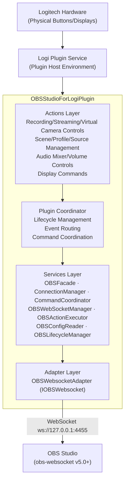

# Project Structure

## High-Level Architecture



## Directory Organization

```
OBSStudioForLogiPlugin/
├── src/                          # Main plugin source code
│   ├── Actions/                  # Command implementations for hardware controls
│   ├── Services/                 # Core business logic and OBS integration
│   ├── Helpers/                  # Utility classes (logging, resources)
│   ├── Models/                   # Data models and configuration structures
│   ├── Icons/                    # Embedded SVG/PNG resources for UI
│   ├── package/metadata/         # Plugin metadata and packaging
│   └── *.cs                      # Root plugin and application classes
├── tests/                        # Unit and integration tests
│   └── OBSStudioForLogiPlugin.Tests/
│       ├── Actions/              # Command/action integration tests
│       └── *.cs                  # Service and business logic unit tests
├── coverage-results/             # Code coverage reports (Cobertura XML)
└── bin/                          # Build output (Debug/Release)
```

## Core Components

### Plugin Entry Points

- **OBSStudioForLogiPlugin.cs**: Main plugin class, singleton instance, manages lifecycle and coordinates all subsystems
- **OBSStudioForLogiApplication.cs**: Defines OBS application detection (process name: obs64.exe, bundle: com.obsproject.obs-studio)

### Actions Layer (`src/Actions/`)

Command classes that handle user interactions from Loupedeck hardware:

**Base Classes** (reusable patterns):

- `ToggleCommandBase.cs`: Base class for toggle commands (on/off states)
- `StartStopCommandBase.cs`: Base class for start/stop command pairs

**Display Commands** (read-only status indicators):

- `ConnectionStatusDisplay.cs`: Shows connection status (Connected/Disconnected)
- `CurrentProfileDisplay.cs`: Shows active OBS profile name
- `CurrentSceneCollectionDisplay.cs`: Shows active scene collection name
- `CurrentSceneDisplay.cs`: Shows current active scene

**Interactive Commands** (user-triggered actions):

- `ProfileSelectCommand.cs`: Multi-state command for switching OBS profiles
- `ProfilesDynamicFolder.cs`: Dynamic folder containing all available profiles
- `SceneCollectionSelectCommand.cs`: Multi-state command for switching scene collections
- `ScenesDynamicFolder.cs`: Dynamic folder containing all available scenes as buttons
- `SceneSwitchAdjustableCommand.cs`: Encoder-based scene switching (next/previous)
- `SourcesDynamicFolder.cs`: Dynamic folder showing sources in current scene with visibility toggle
- `AudioMixerDynamicFolder.cs`: Dynamic folder with all audio inputs (mute/unmute, volume display)
- `SceneAudioSourcesDynamicFolder.cs`: Dynamic folder with audio inputs in current scene
- `AudioInputDynamicFolderBase.cs`: Base class for audio folder implementations
- `AudioSelectDynamicFolder.cs`: Selection-only folder for setting global audio source
- `AudioVolumeDynamicFolder.cs`: MX-compatible folder with adjustment tiles for wheel volume control
- `AudioVolumeWheelTool.cs`: Wheel/encoder tool for adjusting selected audio input volume (CT)
- `SelectedSourceVolumeAdjustment.cs`: Standalone adjustment for wheel/dial volume of selected source
- `RecordingToggleCommand.cs`: Toggle recording on/off (uses ToggleCommandBase)
- `RecordingStartCommand.cs`: Start recording (uses StartStopCommandBase)
- `RecordingStopCommand.cs`: Stop recording (uses StartStopCommandBase)
- `RecordingPauseToggleCommand.cs`: Pause/resume recording
- `StreamingToggleCommand.cs`: Toggle streaming on/off (uses ToggleCommandBase)
- `StreamingStartCommand.cs`: Start streaming (uses StartStopCommandBase)
- `StreamingStopCommand.cs`: Stop streaming (uses StartStopCommandBase)
- `VirtualCameraToggleCommand.cs`: Toggle virtual camera on/off (uses ToggleCommandBase)
- `VirtualCameraStartCommand.cs`: Start virtual camera (uses StartStopCommandBase)
- `VirtualCameraStopCommand.cs`: Stop virtual camera (uses StartStopCommandBase)
- `ReplayBufferToggleCommand.cs`: Toggle replay buffer on/off (uses ToggleCommandBase)
- `ReplayBufferSaveCommand.cs`: Save replay buffer to disk
- `StudioModeToggleCommand.cs`: Toggle studio mode on/off (uses ToggleCommandBase)
- `StudioModeTransitionCommand.cs`: Trigger studio mode transition (preview to program)
- `ReconnectCommand.cs`: Manually retry connection to OBS
- `ScreenshotCommand.cs`: Capture screenshot via OBS
- `SourceVisibilityAdjustableCommand.cs`: Toggle source visibility (user-configured, ActionEditorCommand)
- `AudioMuteAdjustableCommand.cs`: Toggle mute for named audio source (ActionEditorCommand)
- `AudioMonitoringCycleAdjustableCommand.cs`: Cycle audio monitoring type (ActionEditorCommand)
- `AudioSelectAdjustableCommand.cs`: Toggle global audio source selection (ActionEditorCommand)
- `StatsDisplay.cs`: Summary button showing FPS, CPU%, and dropped frames
- `StatsDynamicFolder.cs`: Dynamic folder with individual tiles per stat (FPS, CPU, Memory, Render Missed, Encode Skipped, Total Dropped)
- `PluginSettingsCommand.cs`: Configure plugin settings including OBS connection and stats polling interval (ActionEditorCommand)
- `MediaDynamicFolder.cs`: Dynamic folder of media sources with play/pause/stop controls
- `MediaActionCommand.cs`: Trigger media actions on named source (ActionEditorCommand)

### Services Layer (`src/Services/`)

Core business logic and OBS integration:

**Connection Management:**

- **ConnectionManager.cs**: Manages OBS connection lifecycle (52 lines)
  - Encapsulates OBSWebSocketManager, OBSConfigReader, OBSLifecycleManager
  - Handles ConnectAsync(), Disconnect(), IsConnected
  - Reads configuration, waits for port, connects to WebSocket

**Command Coordination:**

- **CommandRegistry.cs**: Manages command registration and event distribution
  - Stores registered commands implementing IObsCommand interfaces
  - Provides notification methods for all event types
- **CommandCoordinator.cs**: Facade for CommandRegistry (93 lines)
  - RegisterCommand() for command self-registration
  - 13 notification methods (NotifyConnected, NotifyProfileChanged, etc.)
  - Delegates to CommandRegistry
- **IObsCommand.cs**: Interface hierarchy for command registration
  - Base IObsCommand with OnConnected/OnDisconnected
  - 11 specialized interfaces (IProfileAwareCommand, ISceneAwareCommand, etc.)

**OBS Integration:**

- **OBSFacade.cs**: Single point of access to OBS functionality (227 lines)
  - 7 state properties (IsRecording, IsStreaming, CurrentProfile, etc.)
  - 10 query methods (GetProfileList, GetSceneList, GetInputList, etc.)
  - 20+ action methods (ToggleRecording, SwitchScene, ToggleInputMute, etc.)
  - Connection validation and error handling
- **OBSWebSocketManager.cs**: Primary WebSocket connection manager
  - Handles connect/disconnect/reconnect with exponential backoff and jitter
  - Event routing, timer-based continuous reconnection
- **OBSActionExecutor.cs**: Executes OBS commands
  - Scene switching, recording control, streaming control
  - Virtual camera, replay buffer, studio mode
  - Profile management, source visibility, audio control
- **IOBSWebsocket.cs**: Interface abstraction for OBS WebSocket operations (enables testing/mocking)
- **OBSWebsocketAdapter.cs**: Adapter wrapping obs-websocket-dotnet library
- **OBSConfigReader.cs**: Reads OBS configuration files to discover WebSocket settings (port, password)
- **OBSLifecycleManager.cs**: Manages connection lifecycle, port availability checking
- **PluginConfigReader.cs**: Reads and writes plugin-specific configuration from AppData
- **StatsService.cs**: Timer-based polling service for OBS performance statistics

### Helpers Layer (`src/Helpers/`)

- **PluginLog.cs**: Centralized logging wrapper (implements IPluginLog)
- **IPluginLog.cs**: Logging interface for dependency injection
- **LogLevel.cs**: Enum defining log levels (Trace, Debug, Info, Warning, Error)
- **PluginResources.cs**: Embedded resource loader for icons and images
- **OBSTimings.cs**: Centralized timing constants for OBS operations and tests
- **ButtonImageHelper.cs**: Static helper for all button image rendering (icons, text, state-based)
- **ButtonTextRenderer.cs**: Text rendering with dynamic font sizing and layout
- **AudioSelectionState.cs**: Static state tracker for which audio input is selected for dial control
- **VolumeConverter.cs**: Static helper for volume multiplier to dB conversion and formatting
- **PressTimingHelper.cs**: DoubleTapHelper for distinguishing single/double tap on buttons

### Models Layer (`src/Models/`)

- **OBSConnectionSettings.cs**: Data model for WebSocket connection configuration (URL, port, password)
- **PluginConfig.cs**: Plugin configuration model (log level, connection settings, stats polling interval)
- **OBSStats.cs**: Data model for OBS performance statistics (CPU, memory, FPS, frame counts)

## Architectural Patterns

### Single Responsibility Principle

The codebase follows SRP by splitting concerns into focused classes:

- **ConnectionManager** - Connection lifecycle only
- **CommandCoordinator** - Command coordination only
- **OBSFacade** - OBS interface only
- **OBSStudioForLogiPlugin** - Orchestration and event routing only

This separation improves:

- **Testability** - Mock only what you need
- **Maintainability** - Changes are isolated
- **Understandability** - Each class has clear purpose
- **Reusability** - Components can be used independently

### Command Registry Pattern

Commands self-register with the plugin via interfaces:

```csharp
public class ScenesDynamicFolder : PluginDynamicFolder, IObsCommand, ISceneAwareCommand
{
    public ScenesDynamicFolder()
    {
        Instance = this;
        OBSStudioForLogiPlugin.Instance?.RegisterCommand(this);
    }
    
    public void OnConnected() { }
    public void OnDisconnected() { }
    public void OnSceneChanged(String sceneName) { }
}
```

Benefits:

- No manual registration needed in main plugin
- Compile-time safety via interfaces
- Automatic notification routing

### Facade Pattern

OBSFacade provides simplified interface to complex OBS subsystem:

```csharp
public class OBSFacade
{
    private readonly OBSWebSocketManager _obsManager;
    
    // Simple interface
    public Boolean IsRecording { get; }
    public void ToggleRecording() { }
    public String[] GetSceneList() { }
    
    // Hides complexity of:
    // - Connection validation
    // - Null checking
    // - Error handling
    // - OBSWebSocketManager → OBSActionExecutor delegation
}
```

### Singleton Pattern

Most command classes use singleton instances accessed via static `Instance` property:

```csharp
public static SceneCollectionSelectCommand Instance { get; private set; }
```

This allows the main plugin to notify commands of state changes without maintaining explicit references.

### Event-Driven Architecture

- Plugin subscribes to Loupedeck ClientApplication events (ApplicationStarted, ApplicationStopped)
- OBSWebSocketManager raises events for OBS state changes (scene changes, profile changes, recording state)
- Commands subscribe to relevant events and update their UI state accordingly

### Adapter Pattern

`OBSWebsocketAdapter` wraps the third-party `obs-websocket-dotnet` library, providing:

- Abstraction layer for easier testing
- Consistent error handling
- Event translation to plugin-specific formats

### Command Pattern

Each action inherits from Loupedeck base classes:

- `PluginMultistateDynamicCommand`: Commands with multiple states (selected/unselected)
- `PluginDynamicCommand`: Simple action commands
- Commands implement `RunCommand(String actionParameter)` for execution

### Dependency Injection (Partial)

- Services use interface abstractions (IOBSWebsocket) for testability
- PluginLog uses IPluginLog interface
- Main plugin instantiates concrete implementations

## Component Relationships

```
OBSStudioForLogiPlugin (main - 289 lines)
    ├── ConnectionManager (connection lifecycle - 52 lines)
    │   ├── OBSWebSocketManager
    │   ├── OBSConfigReader
    │   └── OBSLifecycleManager
    ├── CommandCoordinator (command coordination - 93 lines)
    │   └── CommandRegistry
    ├── OBSFacade (OBS interface - 227 lines)
    │   └── OBSWebSocketManager
    │       ├── OBSWebsocketAdapter (library wrapper)
    │       └── OBSActionExecutor (command execution)
    └── Commands (Actions/)
        ├── Display Commands (ConnectionStatus, CurrentProfile, CurrentScene, CurrentSceneCollection)
        ├── Profile Commands (ProfileSelect, ProfilesDynamicFolder)
        ├── Scene Commands (SceneCollectionSelect, ScenesDynamicFolder, SourcesDynamicFolder)
        ├── Recording Commands (Toggle, Start, Stop, Pause)
        ├── Streaming Commands (Toggle, Start, Stop)
        ├── Replay Buffer Commands (Toggle, Save)
        ├── Virtual Camera Commands (Toggle, Start, Stop)
        ├── Studio Mode Commands (Toggle, Transition)
        ├── Audio Commands (AudioMixer, SceneAudio, AudioSelect, AudioVolume, SelectedSourceVolume)
        ├── User Defined Actions (SceneSwitch, SourceVisibility, AudioMute, AudioMonitoring, AudioSelect)
        └── Utility Commands (Screenshot, Reconnect)
```

### Data Flow

1. **Startup**: Plugin loads → ConnectionManager.ConnectAsync() → reads OBS config → waits for port → connects to WebSocket
2. **User Action**: Hardware button press → Command.RunCommand() → Plugin delegates to OBSFacade → OBSActionExecutor → WebSocket request
3. **OBS Event**: WebSocket event → OBSWebSocketManager → Plugin callback → CommandCoordinator.Notify*() → Commands update UI
4. **Command Registration**: Command constructor → OBSStudioForLogiPlugin.RegisterCommand() → CommandCoordinator.RegisterCommand() → CommandRegistry stores command

## Build Configuration

### Project Structure

- **Target Framework**: .NET 8.0
- **Root Namespace**: Loupedeck.OBSStudioForLogiPlugin
- **Output**: Custom paths to Logi Plugin Service directories
- **Platform**: Cross-platform (Windows/macOS with conditional compilation)

### Build Targets

- **CopyPackage**: Copies metadata and package files to output
- **PostBuild**: Creates .link file in plugin directory, triggers hot-reload via loupedeck:// protocol
- **PluginClean**: Removes link files and output directories

### Dependencies

- **PluginApi.dll**: Loupedeck SDK (referenced from system installation)
- **obs-websocket-dotnet** (v5.0.1): NuGet package for OBS WebSocket communication
